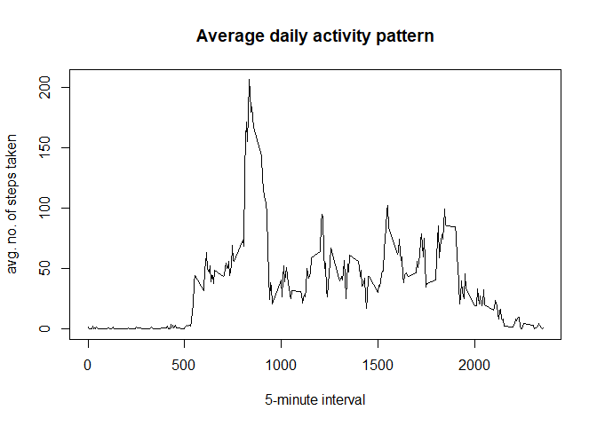
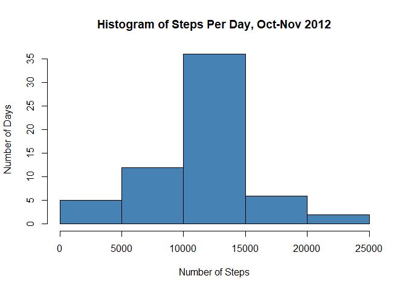
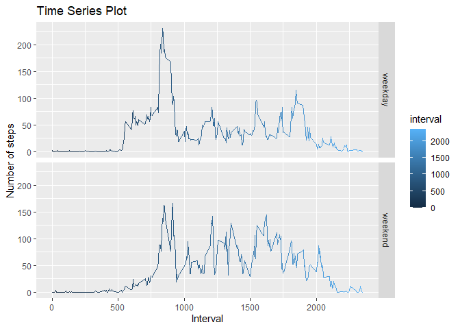

# Assignment
This assignment will be described in multiple parts. You will need to write a report that answers the questions detailed below. Ultimately, you will need to complete the entire assignment in a single R markdown document that can be processed by knitr and be transformed into an HTML file.

Throughout your report make sure you always include the code that you used to generate the output you present. When writing code chunks in the R markdown document, always use echo = TRUE so that someone else will be able to read the code. This assignment will be evaluated via peer assessment so it is essential that your peer evaluators be able to review the code for your analysis.

For the plotting aspects of this assignment, feel free to use any plotting system in R (i.e., base, lattice, ggplot2)

Fork/clone the GitHub repository created for this assignment. You will submit this assignment by pushing your completed files into your forked repository on GitHub. The assignment submission will consist of the URL to your GitHub repository and the SHA-1 commit ID for your repository state.

NOTE: The GitHub repository also contains the dataset for the assignment so you do not have to download the data separately.

## 1. Loading and preprocessing the data

### 1.1. Code for reading in the dataset 

```r
# extract "activity.csv" from "activity.zip" file
unzip("activity.zip",overwrite=TRUE)

# read data from "activity.csv" into "df" dataframe
df = read.csv("activity.csv")

# understanding data stored in df
str(df)
```

```
## 'data.frame':	17568 obs. of  3 variables:
##  $ steps   : int  NA NA NA NA NA NA NA NA NA NA ...
##  $ date    : chr  "2012-10-01" "2012-10-01" "2012-10-01" "2012-10-01" ...
##  $ interval: int  0 5 10 15 20 25 30 35 40 45 ...
```

### 2.2. Code for processing the data ( Converting date from "Character" format to "Date" Format)

```r
df$date = as.Date(df$date,"%Y-%m-%d")

str(df)
```

```
## 'data.frame':	17568 obs. of  3 variables:
##  $ steps   : int  NA NA NA NA NA NA NA NA NA NA ...
##  $ date    : Date, format: "2012-10-01" "2012-10-01" ...
##  $ interval: int  0 5 10 15 20 25 30 35 40 45 ...
```

## 2. What is mean total number of steps taken per day?

### 2.1. Remove incomplete observation

```r
df1=df[complete.cases(df), ]
str(df1)
```

```
## 'data.frame':	15264 obs. of  3 variables:
##  $ steps   : int  0 0 0 0 0 0 0 0 0 0 ...
##  $ date    : Date, format: "2012-10-02" "2012-10-02" ...
##  $ interval: int  0 5 10 15 20 25 30 35 40 45 ...
```

### 2.2. Calculate the total number of steps taken per day

```r
daysteps = aggregate(steps ~ date, data = df1, sum)

head(daysteps)
```

```
##         date steps
## 1 2012-10-02   126
## 2 2012-10-03 11352
## 3 2012-10-04 12116
## 4 2012-10-05 13294
## 5 2012-10-06 15420
## 6 2012-10-07 11015
```

### 2.3 Histogram of the total number of steps taken each day


```r
hist(daysteps$steps, xlab="Number of Steps", main="Histogram of Steps Per Day, Oct-Nov 2012")
```

<!-- -->

### 2.4 The mean and median of the total number of steps taken per day


```r
daysteps_mean = mean(daysteps$steps)
cat("The mean of the total number of steps taken per day is :",daysteps_mean)
```

```
## The mean of the total number of steps taken per day is : 10766.19
```

```r
daysteps_median = median(daysteps$steps)
cat("\nThe median of the total number of steps taken per day is: ",daysteps_median)
```

```
## 
## The median of the total number of steps taken per day is:  10765
```

<hr>

## 3. What is the average daily activity pattern?

### 3.1 Time series plot of the 5-minute interval (x-axis) and the average number of steps taken, averaged across all days (y-axis)


```r
avgpat = aggregate(steps ~ interval, data = df1, mean)
head(avgpat)
```

```
##   interval     steps
## 1        0 1.7169811
## 2        5 0.3396226
## 3       10 0.1320755
## 4       15 0.1509434
## 5       20 0.0754717
## 6       25 2.0943396
```

```r
plot(avgpat$interval,avgpat$steps, type = "l" , xlab = "5-minute interval", ylab = "avg. no. of steps taken", main = "Average daily activity pattern")
```

<!-- -->

### 3.2 5-minute interval, on average across all the days in the dataset, contains the maximum number of steps


```r
# Learning Summary of 'avgpat' dataset
summary(avgpat)
```

```
##     interval          steps        
##  Min.   :   0.0   Min.   :  0.000  
##  1st Qu.: 588.8   1st Qu.:  2.486  
##  Median :1177.5   Median : 34.113  
##  Mean   :1177.5   Mean   : 37.383  
##  3rd Qu.:1766.2   3rd Qu.: 52.835  
##  Max.   :2355.0   Max.   :206.170
```

```r
# 5-minute interval, on average across all the days in the dataset, contains the maximum number of steps
avgpat[avgpat$steps == max(avgpat$steps),1]
```

```
## [1] 835
```

## 4. Imputing missing values

### 4.1. Total number of missing values in the dataset (i.e. the total number of rows with NAs)


```r
# Total no. of rows
nrow(df)
```

```
## [1] 17568
```

```r
# Total no. of rows without NA vales
    ## df1 = df[complete.cases(df), ]
nrow(df1)
```

```
## [1] 15264
```

```r
# Total no. of rows with NAs

    ## na_records = nrow(df[!complete.cases(df), ])
 na_records = nrow(df) - nrow(df1)
 na_records
```

```
## [1] 2304
```


### 4.2. the mean for that 5-minute interval is filling in all of the missing values in the dataset


```r
# Identifying Positions of missing value in original dataset
na_pos <- which(is.na(df))
head(na_pos)
```

```
## [1] 1 2 3 4 5 6
```

```r
# Creating a new dataset that is equal to the original dataset but Replacing missing values with the mean for that 5-minute interval.

df2 <- df

for (i in na_pos) {
  index <- match(df[i,"interval"],avgpat$interval)
  df2[i,"steps"] <- avgpat[index,"steps"]
}
```

### 4.3 Make a histogram of the total number of steps taken each day

```r
df2steps = aggregate(steps ~ date, data = df2, sum)
head(df2steps)
```

```
##         date    steps
## 1 2012-10-01 10766.19
## 2 2012-10-02   126.00
## 3 2012-10-03 11352.00
## 4 2012-10-04 12116.00
## 5 2012-10-05 13294.00
## 6 2012-10-06 15420.00
```

```r
hist(df2steps$steps, col="steelblue", xlab="Number of Steps", ylab="Number of Days",  main="Histogram of Steps Per Day, Oct-Nov 2012")
```

<!-- -->

### 4.4 The mean and median of the total number of steps taken per day


```r
df2steps_mean = mean(df2steps$steps)
cat("The mean of the total number of steps taken per day is :",df2steps_mean)
```

```
## The mean of the total number of steps taken per day is : 10766.19
```

```r
df2steps_median = median(df2steps$steps)
cat("\nThe median of the total number of steps taken per day is: ",df2steps_median)
```

```
## 
## The median of the total number of steps taken per day is:  10766.19
```

### 4.5  Values differ from the estimates from the first part of the assignment? What is the impact of imputing missing data on the estimates of the total daily number of steps?


```r
# NA removed dataset
summary(daysteps$steps)
```

```
##    Min. 1st Qu.  Median    Mean 3rd Qu.    Max. 
##      41    8841   10765   10766   13294   21194
```

```r
# dataset with NA imputed
summary(df2steps$steps)
```

```
##    Min. 1st Qu.  Median    Mean 3rd Qu.    Max. 
##      41    9819   10766   10766   12811   21194
```

In Activity dataset, steps per day mean and median doesn't affect much by replacing Na values with mean for that 5-minute slot. But 1st quartile and 3rd quartile values has been raise by around 1000 step counts which is helpful for having significant population for calculation.


## 5. Are there differences in activity patterns between weekdays and weekends?

### 5.1. Create a new factor variable in the dataset with two levels – “weekday” and “weekend” indicating whether a given date is a weekday or weekend day.


```r
df2$week <- ifelse(weekdays(df2$date) %in% c("Saturday","Sunday"), "weekend", "weekday")

df2$week <- as.factor(df2$week)
                              
str(df2)
```

```
## 'data.frame':	17568 obs. of  4 variables:
##  $ steps   : num  1.717 0.3396 0.1321 0.1509 0.0755 ...
##  $ date    : Date, format: "2012-10-01" "2012-10-01" ...
##  $ interval: int  0 5 10 15 20 25 30 35 40 45 ...
##  $ week    : Factor w/ 2 levels "weekday","weekend": 1 1 1 1 1 1 1 1 1 1 ...
```

### 5.2. Make a panel plot containing a time series plot (i.e. type = "l") of the 5-minute interval (x-axis) and the average number of steps taken, averaged across all weekday days or weekend days (y-axis).


```r
weekavg <- aggregate(steps ~ interval + week, df2, mean )

library(ggplot2)
```

```
## Warning: package 'ggplot2' was built under R version 4.0.3
```

```r
g <- ggplot(weekavg,aes(interval,steps, col = interval))

g+geom_line()+facet_grid(week~.) + labs(x = "Interval", y = "Number of steps", title = "Time Series Plot")
```

<!-- -->
